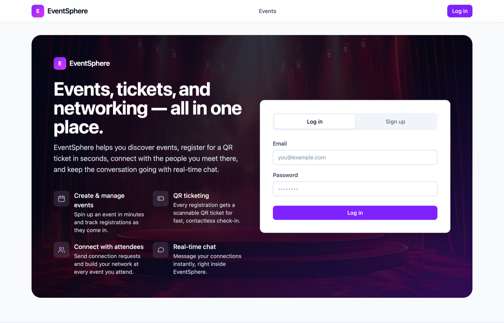
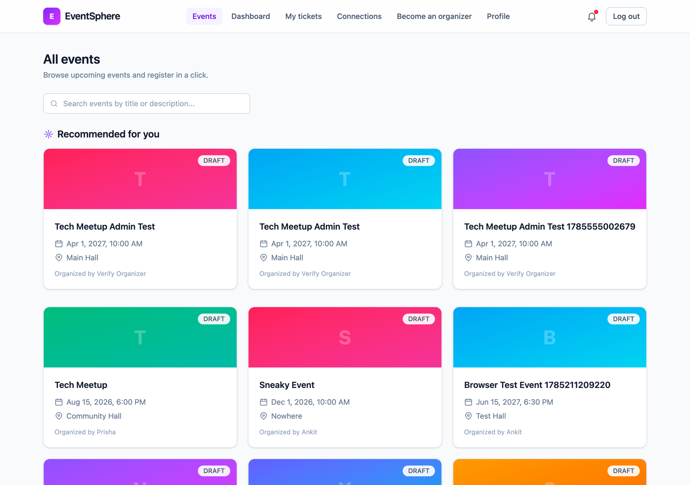
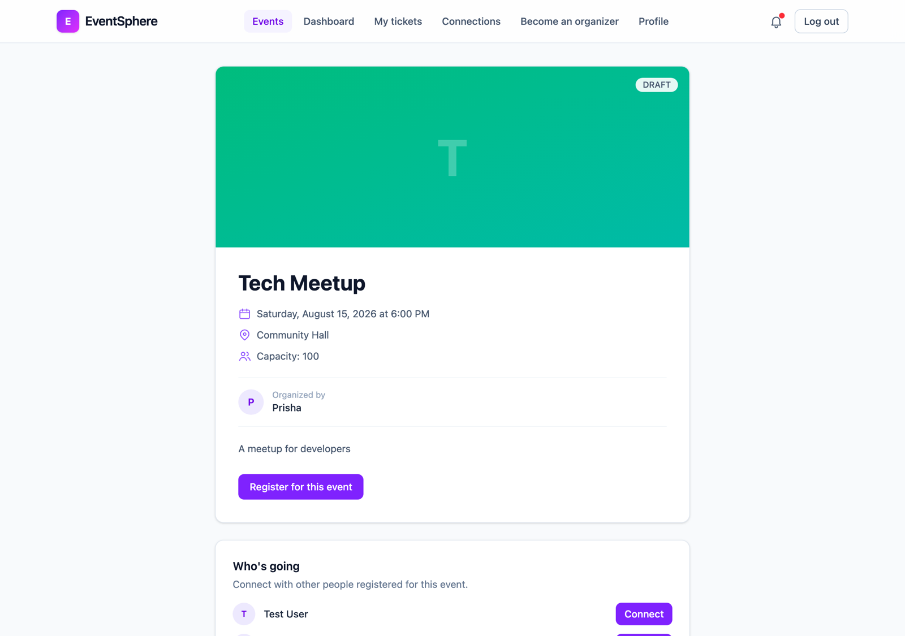
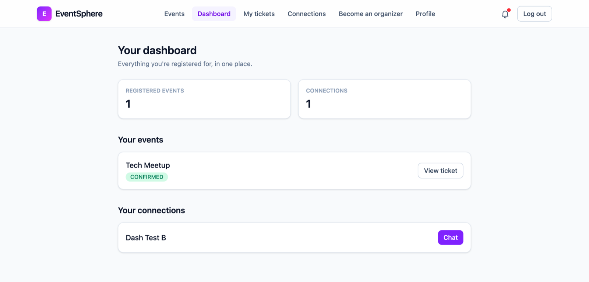
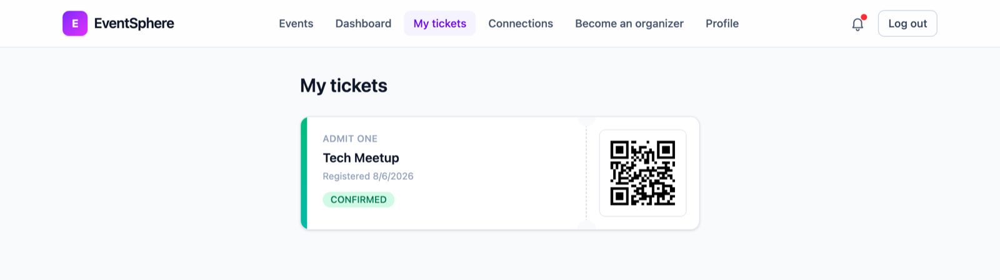
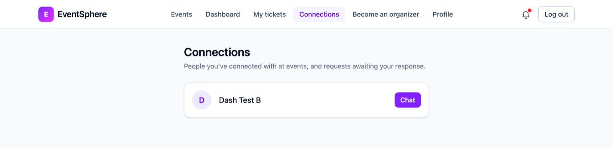
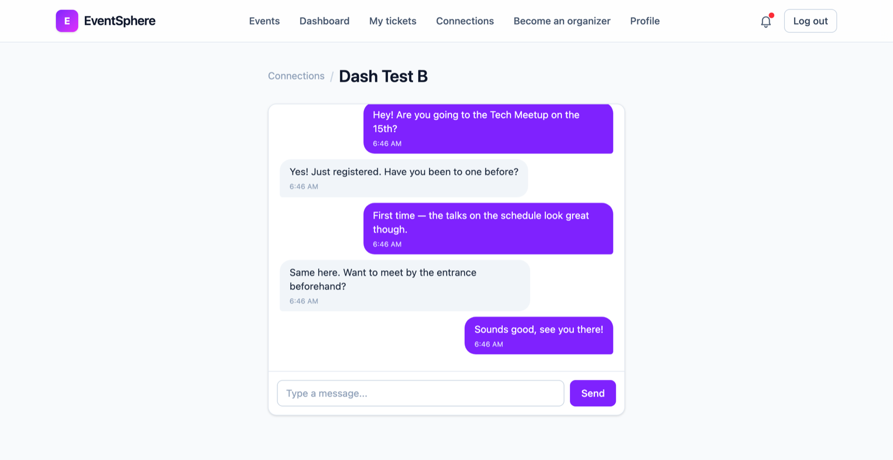

# EventSphere

A full-stack event management and networking platform for hackathons, workshops, and conferences — built with React, Spring Boot, and Spring AI.

> 🚧 **Work in progress** — this project is being built incrementally, day by day. This README will be updated as new features are completed.

## What it does

EventSphere brings the entire lifecycle of an event into one platform:

- Organizers create and manage events, generate QR tickets, and track attendance
- Participants browse events, register, get digital tickets, and connect with other attendees who share an event
- Admins review who gets to become an organizer, and keep an overview of everyone using the platform
- AI assists organizers by drafting event descriptions, and helps participants find events through search and history-based recommendations

Every account starts as a **Participant**. Organizer access isn't self-selected at signup — it's requested from inside the app and approved by an admin, the same way a real platform would gate who's allowed to run events.

## Screenshots

### Landing & sign-in
Marketing landing page with an inline login/signup panel.



### Browse, search & recommendations
Events are searchable by title or description. Signed-in participants also get a **Recommended for you** row, derived from the events they've previously registered for.



### Event detail
Full event info, one-click registration, and a "Who's going" list where attendees can send each other connection requests.



### Participant dashboard
A single view of everything you're registered for and everyone you've connected with.



### QR tickets
Every registration issues a scannable QR ticket, used by organizers for contactless check-in.



### Connections & real-time chat
Connection requests gate messaging — you can only chat with people who accepted. Messages are delivered live over WebSocket/STOMP.





## Tech stack

- **Frontend:** React + Tailwind CSS
- **Backend:** Spring Boot (Java)
- **Database:** PostgreSQL
- **Caching:** Redis
- **AI:** Spring AI
- **Auth:** Spring Security + JWT
- **Infra (local dev):** Docker Compose

## Project structure

```
eventsphere/
├── eventsphere-backend/     # Spring Boot API
├── eventsphere-frontend/    # React app
├── documentations/          # Design docs, ER diagram, blueprint
└── docker-compose.yml       # Postgres + Redis for local dev
```

## Getting started (local dev)

**Prerequisites:** Java 17+, Node.js 20+, Docker Desktop

```bash
# 1. Start Postgres + Redis
docker compose up -d

# 2. Configure the backend
cd eventsphere-backend
cp src/main/resources/application.properties.example src/main/resources/application.properties
# then edit application.properties with your local values

# 3. Run the backend
./mvnw spring-boot:run

# 4. Run the frontend (in a separate terminal)
cd eventsphere-frontend
npm install
npm run dev
```

## Progress

- [x] Project setup (Docker, Postgres, Spring Boot, React scaffolding)
- [x] Authentication — register, login, JWT, protected routes
- [x] Event management (create, browse, edit, **delete** events)
- [x] Registration & QR ticketing
- [x] Attendance tracking + full check-in dashboard
- [x] Networking & real-time chat (WebSocket/STOMP)
- [x] Notifications (backend + navbar bell/dropdown)
- [x] Organizer approval workflow — apply from the app, admin approves/rejects
- [x] Admin panel — pending requests, participants directory, organizers directory, all-events overview
- [x] Production-style UI redesign (Tailwind CSS, role-aware navigation, consistent component kit)
- [x] Event search + history-based recommendations
- [x] AI-assisted event descriptions (Spring AI → Gemini)
- [x] Certificate of participation (generated per check-in)
- [x] Participant dashboard
- [ ] Deployment

The organizer-approval workflow and admin panel weren't part of the original 6-week blueprint — they were added afterward once it became clear that letting anyone self-select "Organizer" at signup was both a product gap (no gatekeeping) and a real security hole (the API accepted *any* role string, including `ADMIN`, with no server-side check). See `Architecture_Design.md` and `documentations/phase5.md` for the full reasoning.

---

\_Built as a portfolio project to demonstrate full-stack architecture, authentication, real-time features, and AI integration.
